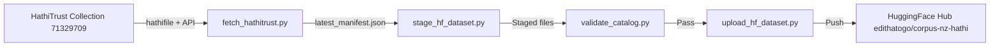

# Hathi NZ Corpus Pipeline

**Systematic acquisition, staging, validation, and sync pipeline** for the **NZ Parliamentary Debates (Hansard, 1854–1990)** corpus from HathiTrust Digital Library, published to Hugging Face Hub as [`edithatogo/corpus-nz-hathi`](https://huggingface.co/edithatogo/corpus-nz-hathi).

[](https://osf.io/)
[](https://zenodo.org/)



## Overview

This repository builds and maintains a living corpus of **510 volumes** of New Zealand Parliamentary Debates (Hansard), spanning **1854 to 1990**, sourced from the [HathiTrust Digital Library](https://www.hathitrust.org/) (Collection ID `71329709`, source institution `uc1` — University of California).

The corpus is published across three platforms:

| Platform | Role | URL |
|----------|------|-----|
| **Hugging Face Hub** | Live, queryable dataset (Parquet + raw files) | [`edithatogo/corpus-nz-hathi`](https://huggingface.co/edithatogo/corpus-nz-hathi) |
| **GitHub** | Pipeline code, schemas, metadata, workflows | [`edithatogo/hathi-nz`](https://github.com/edithatogo/hathi-nz) |
| **Zenodo** | DOI-backed release snapshots for academic citation | [Archive registry](manifests/hathitrust-nz/archive_registry.json) |
| **OSF** | Secondary release mirror that reuses Zenodo DOI-backed snapshot metadata | Configured via `OSF_PROJECT_ID` |


## Architecture

The pipeline follows a **decoupled, four-stage design**:

```
HathiTrust Sources (HathiFile dumps + Data API)
        │
        ▼
┌───────────────────────────────────┐
│  fetch_hathitrust.py              │
│  Volume enumeration & catalog     │
│  -> parses hathifiles             │
│  -> API metadata lookups          │
│  -> writes latest_manifest        │
└───────────┬───────────────────────┘
            │ manifests/latest_manifest.json
            ▼
┌───────────────────────────────────┐
│  stage_hf_dataset.py              │
│  Download, verify, build HF-ready │
│  -> downloads volumes             │
│  -> SHA-256 verification          │
│  -> builds Parquet metadata       │
│  -> writes stage state            │
└───────────┬───────────────────────┘
            │ data/raw/, data/processed/, data/_state/
            ▼
┌───────────────────────────────────┐
│  validate_catalog.py              │
│  Quality gate (blocks on errors)  │
│  -> schema validation             │
│  -> consistency checks            │
│  -> staged file verification      │
│  -> writes validation report      │
└───────────┬───────────────────────┘
            │ PASS
            ▼
┌───────────────────────────────────┐
│  upload_hf_dataset.py             │
│  Push to Hugging Face Hub         │
│  -> ensures HF repo exists        │
│  -> uploads metadata + files      │
│  -> dry-run mode supported        │
│  -> writes upload state           │
└───────────┬───────────────────────┘
            │
            ▼
    HuggingFace Hub: edithatogo/corpus-nz-hathi
            │
            ▼
    .github/workflows/hf_sync.yml (daily/manual automation)
```

## Collection Details

| Property | Value |
|----------|-------|
| **Collection** | NZ Parliamentary Debates (Hansard) |
| **HathiTrust Collection ID** | `71329709` |
| **Expected volumes** | 510 |
| **Date range** | 1854 – 1990 |
| **Source institution** | `uc1` (University of California) |
| **Primary content category** | `debates` |
| **Rights status** | Public domain (`pd`) for most volumes |
| **Languages** | English (`en`), New Zealand English (`nz`) |

## Tech Stack

| Component | Choice |
|-----------|--------|
| Runtime | Python 3.14 |
| Package manager | [pixi](https://pixi.sh) (Rust-powered) |
| Data querying | DuckDB |
| Data frames | Polars |
| Serialization | PyArrow |
| HF interface | huggingface-hub (with Xet) |
| HTTP client | requests |
| Validation | Pydantic |
| Linter/Formatter | Ruff (strict rules) |
| Type checker | ty |
| Test runner | pytest + pytest-cov |

## Directory Structure

```
hathi-nz/
├── conductor/               # Conductor configurations & track specs
├── data/
│   ├── raw/                 # Raw page scans / HathiTrust downloads (Git-ignored)
│   ├── processed/           # Processed / HF-ready files (Git-ignored)
│   ├── metadata/            # Volume-level sidecar JSON files
│   └── _state/              # Pipeline state tracking (Git-ignored)
├── manifests/
│   ├── latest_manifest.json # Catalog of all volumes, hashes, and sizes
│   └── schema.json          # JSON Schema Draft 2020-12 for volume records
├── scripts/
│   ├── fetch_hathitrust.py  # Volume enumeration & manifest generation
│   ├── stage_hf_dataset.py  # Download, verify, and stage dataset
│   ├── upload_hf_dataset.py # Hugging Face Hub upload
│   └── validate_catalog.py  # Catalog & file integrity validation
├── tests/
│   ├── test_fetch_hathitrust.py
│   ├── test_stage_hf_dataset.py
│   ├── test_upload_hf_dataset.py
│   └── test_validate_catalog.py
├── .github/workflows/
│   ├── ci.yml                # CI: lint, typecheck, test on push/PR
│   └── hf_sync.yml           # Daily sync pipeline
├── pixi.toml                # Environment & dependencies
├── pyproject.toml           # Ruff, ty, pytest configuration
├── DATASET_CARD.md          # Hugging Face dataset card
└── README.md                # This file
```

## Corpus Family

This project is part of the NZ corpus-family under the `edithatogo` organization:

| Project | GitHub | Hugging Face | Content |
|---------|--------|--------------|---------|
| **hathi-nz** (this) | `edithatogo/hathi-nz` | `edithatogo/corpus-nz-hathi` | NZ Parliamentary Debates (HathiTrust) |
| **corpus-law-nz** | `edithatogo/corpus-law-nz` | `edithatogo/corpus-legislation-nz` | NZ Legislation |
| **nlp-policy-nz** | `edithatogo/nlp-policy-nz` | — | Shared NLP processing library |
| **corpus-nz-hansard** | _(future)_ | _(future)_ | NZ Hansard (supplementary) |

## Licensing

- **Pipeline code**: Licensed under the repository's code license.
- **Source material**: NZ Parliamentary Debates text is Crown copyright. This project does not relicense the source material. Users should verify HathiTrust rights status for each volume.
- **Metadata**: Project-created metadata (manifests, schemas, dataset cards) are shared under CC-BY-4.0.

## Citation

For live/corpus use, cite the Hugging Face dataset repository with the access date:

```
Edith A. Togo. (2026). corpus-nz-hathi: NZ Parliamentary Debates (1854–1990)
from HathiTrust [Data set]. Hugging Face. https://huggingface.co/edithatogo/corpus-nz-hathi
```

For academic citation, use the DOI recorded in the applicable dataset card or
the [archive registry](manifests/hathitrust-nz/archive_registry.json).

## Maintenance

- **Daily**: GitHub Actions `hf_sync.yml` checks for updates.
- **Monthly**: Review validation reports and coverage metrics.
- **Annually**: Create Zenodo archival snapshot with DOI.
- **Archive registry**: The committed [archive registry](manifests/hathitrust-nz/archive_registry.json)
  maps every collection child to its source, access class, Hugging Face repo,
  Zenodo DOI, and current content status. Its publication-health score is
  separate from content completeness so metadata-only releases cannot be
  mistaken for full-text acquisition.
- **Provenance contract**: [provenance-and-reproducibility.md](docs/provenance-and-reproducibility.md)
  defines the transformation ledger, fail-closed exclusions, checksums,
  workflow evidence, and cross-platform publication relationships.
- **Publication-status reruns**: If a `collection_publish.yml` run has already produced a `hathitrust-nz-collection-publication` artifact, rerun `.github/workflows/publication_status.yml` with `workflow_run_id` set to that run ID to reuse the generated `reports/status/status_report.json` snapshot instead of recomputing from scratch.
- **Redundancy sources**: Treat HathiFiles, OAI-PMH, and the Bibliographic API as metadata redundancy; HTRC EF/Analytics as derived-feature redundancy; and Internet Archive/Open Library as interim overlap sources only.

---

*Built with the Antigravity Swarm — Systematising NZ legal NLP, one volume at a time.*

## Setup

### Prerequisites

- Python 3.14+
- [pixi](https://pixi.sh) installed

### Install

```bash
# Clone the repository
git clone https://github.com/edithatogo/hathi-nz.git
cd hathi-nz

# Create pixi environment
pixi install

# Verify setup
pixi run python -c "import polars; print('OK', polars.__version__)"
```

### Development

```bash
# Install local pre-commit hooks
pixi run pre-commit install

# Run all configured hooks
pixi run pre-commit run --all-files

# Run tests
pixi run pytest

# Run linter
pixi run ruff check scripts/ tests/

# Run type checker
pixi run ty scripts/ tests/
```

## Pipeline Usage

### 1. Build manifest from HathiFile dump

```bash
pixi run python scripts/fetch_hathitrust.py hathifile \
    --hathifile /path/to/hathifile_2026.txt.gz \
    --output manifests/latest_manifest.json \
    --collection-id 71329709 \
    --category debates
```

### 2. Stage the dataset

```bash
pixi run python scripts/stage_hf_dataset.py \
    --manifest manifests/latest_manifest.json \
    --download-dir data/raw \
    --stage-dir data/processed \
    --state-dir data/_state \
    --limit 10
```

### 3. Validate

```bash
pixi run python scripts/validate_catalog.py \
    --manifest manifests/latest_manifest.json \
    --stage-dir data/processed \
    --schema manifests/schema.json \
    --report data/_state/validation_report.json
```

### 4. Upload to Hugging Face

```bash
pixi run python scripts/upload_hf_dataset.py \
    --stage-dir data/processed \
    --repo-id edithatogo/corpus-nz-hathi \
    --state-dir data/_state \
    --commit-message "Sync $(date -I)" \
    --dry-run
```

### 5. Mirror a release to OSF

```bash
pixi run python scripts/package_release.py \
    --version 0.1.0

pixi run python scripts/publish_osf.py \
    --source-dir dist \
    --metadata .osf.json \
    --dataset-card DATASET_CARD.md \
    --project-id "$OSF_PROJECT_ID" \
    --remote-dir releases/0.1.0 \
    --execute
```

The OSF upload reuses the Zenodo DOI recorded in `DATASET_CARD.md` so the
mirrored bundle points back to the canonical archival release. Set `OSF_TOKEN`
and `OSF_PROJECT_ID` in the environment or GitHub Actions secrets before
running the publish step.

Remove `--dry-run` for actual upload. Requires `HF_TOKEN` environment variable.

### 6. Zenodo Release Workflow

The Zenodo release workflow packages the repository snapshot, validates the
release version, publishes the archive, and writes the DOI back into
`DATASET_CARD.md`.

```bash
pixi run python scripts/package_release.py --version 0.1.0
pixi run python scripts/publish_zenodo.py \
    --archive dist/corpus-nz-hathi-0.1.0.zip \
    --dataset-card DATASET_CARD.md \
    --publish \
    --execute
```

In GitHub Actions, the workflow is triggered by a published release or by
manual `workflow_dispatch` with a version input. Set `ZENODO_TOKEN` in
repository secrets and use the `production` input only when you are ready to
publish to the production Zenodo API.

## Containerization

The repository includes a Pixi-backed Docker image and a compose file for
reproducible local execution.

```bash
docker build -t hathi-nz .
docker run --rm hathi-nz python scripts/validate_catalog.py --help
docker compose up --build
```

The compose service mounts `data/`, `manifests/`, and `generated/` from the
host and reads environment variables from `.env` when present. Use `docker
compose run --rm hathi-nz python scripts/validate_catalog.py --help` if you want
to override the default compose command.
