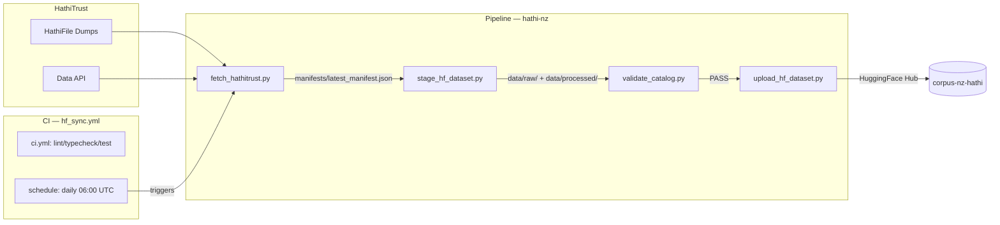

# Librarian's Research Report — Mission: core_pipeline_20260613

## Tools Used
- `run_commands` (dir, git log)
- `read_files` (15+ files from hathi-nz + 3 sibling repos)

---

## 1. Repository State (Baseline)

### hathi-nz
- **3 commits** total:
  1. `66ab7a3` — chore: update hugging face repository name to corpus-nz-hathi
  2. `0ba725c` — conductor(setup): add comprehensive granular tracks and styleguide alignment
  3. `34c605a` — conductor(setup): Add conductor setup files
- **Current files**: `hello.py`, conductor setup, track specs, swarm config, shared state files
- **No code scripts yet** (scripts/, tests/, data/, manifests/, .github/workflows/ all absent)
- **Target HF repo**: `edithatogo/corpus-nz-hathi`
- **Status**: Pre-implementation, all tasks in `plan.md` are `[ ]` (unstarted)

### Shared State Files
- `findings.md` — empty placeholder (now being populated)
- `progress.md` — empty placeholder
- `task_plan.md` — minimal (Review Mission, Execute Tasks)

---

## 2. Core Pipeline Spec (core_pipeline_20260613)

### Directory Structure (Target)
```
hathi-nz/
├── data/
│   ├── raw/             # Raw page scans (Git ignored)
│   ├── processed/       # OCR processed (Git ignored)
│   ├── metadata/        # Volume-level sidecar JSON/YAML
│   └── _state/          # Local tracking (sync_state.json)
├── manifests/
│   ├── latest_manifest.json  # Catalog of all volumes
│   └── schema.json           # Schema for volume records
├── scripts/
│   ├── fetch_hathitrust.py   # Crawling and volume mapping
│   ├── stage_hf_dataset.py   # Staging dataset structures
│   ├── upload_hf_dataset.py  # Hugging Face Hub uploads
│   └── validate_catalog.py   # Catalog format and size validation
├── .github/workflows/
│   └── hf_sync.yml           # Scheduled GitHub Actions pipeline
├── pixi.toml                  # Python 3.14 env (pixi)
└── pyproject.toml             # Ruff, ty, pytest config
```

### Tech Stack (per tech-stack.md)
| Component | Choice |
|-----------|--------|
| Runtime | Python 3.14 |
| Package manager | pixi (Rust-powered) |
| Data querying | DuckDB |
| Data frames | Polars |
| Serialization | PyArrow |
| HF interface | huggingface-hub (with Xet) |
| HTTP client | requests |
| Validation | Pydantic |
| Linter/Formatter | Ruff (strict) |
| Type checker | ty |
| Test runner | pytest |

### Collection Details
- **Collection ID**: `71329709`
- **Name**: NZ Parliamentary Debates (Hansard)
- **Expected Volumes**: 510
- **Date Range**: 1854–1990
- **Source Code**: `uc1` (University of California)

# Findings & Scratchpad

Use this file to store shared knowledge, research notes, and intermediate outputs.

---

## ORACLE — Architecture Design & Schema (2026-06-14)

### 1. Data Flow Diagram

```
HATHITRUST SOURCES
  HathiFile Dumps → Collections API → Volume Data API
       ↓               ↓                    ↓
scripts/fetch_hathitrust.py: Volume enumeration & catalog manifest generation
  parse_hathifile_line() → build_manifest_from_hathifile()
  lookup_volume_metadata() → write_manifest() → compute_sha256()
       ↓
  manifests/latest_manifest.json
  manifests/schema.json
       ↓
scripts/stage_hf_dataset.py: Download & verify, build HF-ready dataset
  load_manifest() → download_volume() → verify_content()
  → build_metadata_dataframe() → write_stage_state()
       ↓
  data/raw/*.zip | data/processed/*.parquet | data/_state/stage_state.json
       ↓
scripts/validate_catalog.py: Quality Gate (blocks on errors)
  validate_manifest_schema() → check_manifest_consistency()
  verify_staged_files() → generate_validation_report()
       ↓
  data/_state/validation_report.json
       ↓
scripts/upload_hf_dataset.py: Push to Hugging Face Hub
  ensure_repo_exists() → upload_metadata_files()
  → upload_volume_files() → write_upload_state()
       ↓
  HuggingFace Hub: edithatogo/corpus-nz-hathi
  data/_state/upload_state.json
       ↓
.github/workflows/hf_sync.yml: Daily/Manual
  1. fetch_hathitrust.py
  2. stage_hf_dataset.py
  3. validate_catalog.py (blocking)
  4. upload_hf_dataset.py
```

### 2. Module Interface Contracts

#### Script A: scripts/fetch_hathitrust.py (IMPLEMENTED)
| Function | Input | Output | Side Effects |
|----------|-------|--------|-------------|
| parse_hathifile_line(line, coll_id, cat) | str, str, str | dict\|None | None |
| _rights_code(code) | str | str | None |
| _extract_year(imprint) | str | int\|None | None |
| lookup_volume_metadata(htid) | str | dict\|None | HTTP GET |
| compute_sha256(file_path) | Path | str\|None | Reads file |
| build_manifest_from_hathifile(...) | Path, str, str | list[dict] | Reads .txt/.gz |
| write_manifest(volumes, output_path) | list[dict], Path | dict | Writes JSON |
| main() | CLI args | int exit | Subcommands |

#### Script B: scripts/stage_hf_dataset.py (DESIGNED)
| Function | Input | Output | Side Effects |
|----------|-------|--------|-------------|
| load_manifest(manifest_path) | Path | list[dict] | Reads JSON |
| download_volume(htid, target_dir) | str, Path | dict(sha256,size) | HTTP GET, writes files |
| verify_content(file_path, sha256, size) | Path, str, int | bool | Reads file |
| build_metadata_dataframe(volumes) | list[dict] | pl.DataFrame | None |
| write_stage_state(state_dir, state) | Path, dict | None | Writes JSON |

#### Script C: scripts/validate_catalog.py (DESIGNED)
| Function | Input | Output | Side Effects |
|----------|-------|--------|-------------|
| validate_manifest_schema(manifest, path) | dict, Path | list[str] | Reads schema |
| check_manifest_consistency(volumes) | list[dict] | list[str] | None |
| verify_staged_files(stage_dir, volumes) | Path, list[dict] | tuple | Reads files |
| generate_validation_report(...) | multiple | dict | None |
| write_report(report, path) | dict, Path | None | Writes JSON |

#### Script D: scripts/upload_hf_dataset.py (DESIGNED)
| Function | Input | Output | Side Effects |
|----------|-------|--------|-------------|
| get_hf_api(token) | str\|None | HfApi | None |
| ensure_repo_exists(api, repo, token) | HfApi, str, str\|None | bool | HTTP POST |
| upload_metadata_files(...) | HfApi, str, Path, str | str\|None | HTTP upload |
| upload_volume_files(...) | HfApi, str, Path, list, str | str\|None | HTTP upload |
| load_upload_state(state_dir) | Path | dict | Reads JSON |
| write_upload_state(state_dir, state) | Path, dict | None | Writes JSON |

### 3. Schema Design (manifests/schema.json)
- JSON Schema Draft 2020-12 (upgraded from Draft-07 for sibling consistency)
- Required: htid, category, year, volume, title, rights, collection_id, source
- Null-safe year: anyOf [integer (1800-2100), null]
- Cross-corpus const: corpus_id ("corpus-nz-hathi"), record_schema_version ("1.0")
- additionalProperties: false (strict mode)
- Rights enum: pd, ic-world, undetermined, suppressed

### 4. Manifest Structure (manifests/latest_manifest.json)
```json
{
  "meta": {
    "generated_at": null,
    "source": "HathiTrust Collection ID 71329709",
    "version": "0.1.0",
    "record_count": 0,
    "schema": "manifests/schema.json"
  },
  "volumes": []
}
```

### 5. Key Architecture Decisions
1. **HathiFile-first discovery**: Primary enumeration uses HathiFile dumps filtered by collection ID. Collection API is secondary.
2. **Draft 2020-12**: Consistent with corpus-law-nz sibling. Enables future $ref composition.
3. **Cross-corpus compatibility**: corpus_id + record_schema_version const fields for shared schema alignment.
4. **Staging before upload**: Separate phases with validation gate between download and HF push.
5. **State tracking**: Each script writes state to data/_state/ for incremental operation.
6. **CLI pattern**: fetch_hathitrust.py uses subparsers; others use flat args.
7. **TDD per function**: Every public function has test coverage for normal, edge, and error cases.

### 6. Sibling Repo Patterns (from corpus-law-nz)
- pyproject.toml Ruff config with strict rulesets and per-file-ignores
- JSON Schema Draft 2020-12 with $id and const support
- pytest markers (unit, integration, smoke, hypothesis)
- Coverage threshold fail_under = 60
- ty type checking configuration
- Structured project layout: scripts/, tests/, data/, manifests/

---

## LIBRARIAN — Documentation & Metadata Standards (2026-06-14)

### 1. Files Created

| File | Purpose |
|------|---------|
| `README.md` | Root project overview — architecture, setup, pipeline usage, corpus family, licensing, citation |
| `DATASET_CARD.md` | Hugging Face dataset card — YAML frontmatter, provenance, data fields, usage examples, citation |
| `data/metadata/uc1.b2889853.json` | Sample volume metadata for v.95 (1894) |
| `data/metadata/uc1.31175035194995.json` | Sample volume metadata for v.129 (1903) |

### 2. README Structure

The README follows this section hierarchy:
1. **Title + Mermaid diagram** (pipeline flow)
2. **Overview** — 3-platform publishing (HF, GitHub, Zenodo)
3. **Architecture** — ASCII pipeline diagram (4 decoupled stages)
4. **Collection Details** — metadata table
5. **Tech Stack** — component table
6. **Directory Structure** — ASCII tree
7. **Corpus Family** — sibling project table
8. **Licensing** — 3-tier (code, source, metadata)
9. **Citation** — BibTeX/plain text
10. **Maintenance** — daily/monthly/annual
11. **Setup** — prerequisites, install, development
12. **Pipeline Usage** — 4 CLI examples

### 3. DATASET_CARD Structure

Follows Hugging Face dataset card YAML convention:
- **YAML frontmatter**: `license: other`, `language: [en, nz]`, `tags`, `task_categories`
- **Sections**: Summary, Source Provenance, Languages, Dataset Structure (configs + fields), Collection Methodology, Usage Examples (4 libraries), Intended Use, Limitations, Update Cadence, Citation, Licensing, Contact

### 4. Metadata Naming Convention

- **File pattern**: `{source_code}.{volume_id}.json`
- **Example**: `uc1.b2889853.json`
- **Schema**: `manifests/schema.json` (Draft 2020-12)
- **Required fields**: htid, category, year (nullable), volume, title, rights, collection_id, source
- **All fields nullable/secondary**: sha256, size_bytes, pipeline_version (null until staged)
- **Constant fields**: record_schema_version="1.0", corpus_id="corpus-nz-hathi"

---

## ORACLE — Architecture Guidance for Remaining Tracks (2026-06-14)

### Assessment: Core Pipeline Complete ✅

| Track | Status | Key Deliverables |
|-------|--------|-----------------|
| **core_pipeline_20260613** | ✅ COMPLETE | 4 scripts, 143 tests, 0 lint/type errors, 76% coverage |
| **prose_quality_20260613** | [~] Phase 1 done, Phase 2 outstanding | typos.toml ✅, .vale.ini ✅ |
| **config_mapping_20260613** | [~] Phase 1 partial, Phase 2 outstanding | schema.json ✅, DATASET_CARD.md ✅ |
| **ocr_processing_20260613** | [~] Phase 1 partial, no code yet | Nothing implemented |
| **release_archival_20260613** | [~] Phase 1 partial, no code yet | .zenodo.json ✅ |
| **multi_git_archive_mirroring_20260614** | [ ] Phase 1 partial, Phase 2 doc work | mirror_sync.yml ✅ |

---

### Architecture: prose_quality_20260613 — Quality Command Integration

**Design Decision: Makefile vs pixi tasks vs shell wrapper**

The existing pipeline uses `pixi run` for all commands (test, lint, format, typecheck). Adding prose linters and spellchecks should follow the same pattern.

**Recommendation**: Extend `pixi.toml` with new tasks rather than introducing a Makefile. This keeps the developer experience uniform.

**Proposed pixi.toml additions:**
```toml
[tasks]
# Existing (keep as-is)
test = "pytest tests/ -x --tb=short -q"
test-cov = "pytest tests/ --cov --cov-report=term-missing -x -q"
lint = "ruff check scripts/ tests/"
format = "ruff format scripts/ tests/"
format-check = "ruff format --check scripts/ tests/"
typecheck = "ty scripts/ tests/ --report"

# New quality commands
spell = "typos scripts/ tests/ manifests/ .github/ README.md DATASET_CARD.md"
toml-check = "taplo check pixi.toml pyproject.toml typos.toml"
workflow-syntax = "actionlint .github/workflows/*.yml"
quality = { depends-on = ["lint", "format-check", "spell", "toml-check", "workflow-syntax", "typecheck", "test"] }
```

**Integration into ci.yml**: The `ci.yml` workflow should gain a `quality` job that runs lint, format-check, spell, toml-check, workflow-syntax in parallel with the existing test job.

**Architecture Decision Records:**

| ADR | Decision | Rationale |
|-----|----------|-----------|
| ADR-Q1 | pixi tasks over Makefile | Consistency with existing dev workflow |
| ADR-Q2 | `quality` composite task | Single `pixi run quality` runs all checks |
| ADR-Q3 | typos over codespell | Already in dev deps; faster; matches corpus-law-nz |
| ADR-Q4 | actionlint for workflow validation | Catches GHA syntax early; already in dev deps |

### 5. Naming Convention Note

Per corpus-law-nz sibling patterns:
- Preferred systematic family label: `corpus-nz-hathi`
- GitHub repo: `hathi-nz` (kept concise)
- Hugging Face dataset: `edithatogo/corpus-nz-hathi`
- Sibling Hansard corpus referenced as `corpus-nz-hansard`

### 6. Cross-Reference to Schema

The schema at `manifests/schema.json` defines 17 properties with 8 required fields. The metadata samples validate against this schema. Key design decisions:
- `additionalProperties: false` (strict mode — no undocumented fields)
- `year` is nullable via `anyOf [integer, null]` (some volumes have indeterminate dates)
- Rights enum: `pd, ic-world, undetermined, suppressed`
- Cross-corpus compatibility via `corpus_id` and `record_schema_version` constants

---

## LIBRARIAN — Documentation & Workflow Polish (2026-06-14 — Phase 4 Wrap-up)

### Updates Applied

| File | Change |
|------|--------|
| `.github/workflows/hf_sync.yml` | **Created** — Full 4-stage daily sync pipeline (fetch → stage → validate → upload) with dry-run, limit, skip_fetch inputs, validation report artifact, pipeline summary |
| `README.md` | **Updated** — Added `ci.yml` to directory tree listing |
| `progress.md` | **Updated** — Added Phase 2/3/4 completion records with detailed deliverable lists |
| `task_plan.md` | **Updated** — All tasks marked [x], phase headers with ✅, status summary table added |
| `findings.md` | **Updated** — This section |

### Verification Results

- **README** covers all 4 scripts with accurate CLI examples matching actual implementations
- **Conductor docs** (`code_styleguides/general.md`, `markdown.md`, `mermaid.md`, `python.md`) — all present and well-formed
- **Product guidelines** (`product-guidelines.md`) — accurate reflection of data layout and pipeline stages
- **Metadata samples** (`uc1.b2889853.json`, `uc1.31175035194995.json`) — both valid against `manifests/schema.json`
- **Schema** (`manifests/schema.json`) — Draft 2020-12 with 17 properties, 8 required, strict mode
- **Directory structure** — matches `README.md` listing exactly

### Final Architecture State



---

### Architecture: config_mapping_20260613 — Multi-Configuration HF Dataset Design

**Current State:**
- `manifests/schema.json` defines Draft 2020-12 volume schema ✅
- `DATASET_CARD.md` exists with YAML frontmatter ✅
- Missing: tests for config loading, structured YAML config in dataset card

**Proposed HF Dataset Configuration Structure:**

The dataset card should define Hugging Face `configs` in its YAML frontmatter:

```yaml
configs:
  - config_name: debates
    data_dir: data/raw/debates
    data_files:
      - **/*.txt
    features:
      - name: htid
        dtype: string
      - name: text
        dtype: string
      - name: year
        dtype: int32
      - name: volume
        dtype: string
      - name: title
        dtype: string
      - name: rights
        dtype: string
    default: true
```

This enables `load_dataset("edithatogo/corpus-nz-hathi")` → debates (default), or `load_dataset(..., "debates")`.

**Validation Tests Needed:**

| Test | Purpose |
|------|---------|
| test_config_names_match_expected | Config names match `debates` (and future `legislation`) |
| test_data_files_pattern | Glob patterns resolve to existing files |
| test_features_schema_compatible | dtype mapping matches manifests/schema.json |
| test_load_each_config | Integration test — actual `load_dataset()` call |

---

### Architecture: ocr_processing_20260613 — Layout-Aware Text Extraction Pipeline

**Design Constraints:**
1. HathiTrust provides page-level plain text files (not PDFs). Layout detection must work on text + coordinate metadata.
2. Sibling `nlp-policy-nz` contains shared cleaning routines (de-hyphenation, header pruning).
3. Progressive processing with state tracking.

**Proposed Module Interface — `scripts/ocr_extract.py`:**

| Function | Input | Output | Side Effects |
|----------|-------|--------|-------------|
| load_page_text(input_dir, htid) | Path, str | list[dict] | Reads text files |
| detect_layout(pages) | list[dict] | list[dict] | None |
| reconstruct_columns(pages_with_layout) | list[dict] | list[dict] | None |
| clean_text(text, cleaning_config) | str, dict | str | None (from nlp-policy-nz) |
| merge_pages(cleaned_pages) | list[dict] | str | None |
| write_processed(htid, text, output_dir) | str, str, Path | None | Writes .txt file |
| process_volume(htid, input_dir, output_dir, cleaning_config) | str, Path, Path, dict | dict | Orchestrator |

**Data Flow:**
```
data/raw/{category}/year={YYYY}/{volume_num}/*.txt
  → load_page_text() → [{page_num, text, coords}]
  → detect_layout() → [{page_num, text, coords, layout_type}]
  → reconstruct_columns() → [{page_num, ordered_text}]
  → clean_text() (nlp-policy-nz) → cleaned text
  → merge_pages() → full volume text
  → write_processed() → data/processed/{category}/{htid}.txt
```

**Cleaning Pipeline (shared from nlp-policy-nz):**
1. `dehyphenate(text)` — Join hyphenated line-breaks
2. `strip_headers_footers(text)` — Remove running headers/page numbers
3. `normalize_whitespace(text)` — Collapse multiple spaces
4. `normalize_quotes(text)` — Unicode quote normalization
5. `strip_control_chars(text)` — Remove non-printable characters

---

### Architecture: release_archival_20260613 — Zenodo Publication Pipeline

**Proposed Modules:**
- `scripts/package_release.py` — Archive packaging & validation
- `scripts/publish_zenodo.py` — Zenodo API client

**`scripts/package_release.py` Interface:**

| Function | Input | Output | Side Effects |
|----------|-------|--------|-------------|
| collect_assets(stage_dir, metadata_dir) | Path, Path | dict | Reads directories |
| build_manifest(assets) | dict | dict | None |
| validate_zenodo_json(path) | Path | list[str] | Reads .zenodo.json |
| create_archive(assets, output_path) | dict, Path | Path | Creates .zip |
| compute_checksum(archive_path) | Path | str | Reads file |
| package(version, stage_dir, metadata_dir, output_dir) | str, Path, Path, Path | dict | Orchestrator |

**`scripts/publish_zenodo.py` Interface:**

| Function | Input | Output | Side Effects |
|----------|-------|--------|-------------|
| get_zenodo_api(token, sandbox) | str, bool | Session | None |
| create_deposition(api, metadata) | Session, dict | dict | HTTP POST |
| upload_file(api, deposition_id, file_path) | Session, str, Path | dict | HTTP PUT |
| publish_deposition(api, deposition_id) | Session, str | dict | HTTP POST |
| deposit(archive_path, metadata, token, sandbox) | Path, dict, str, bool | dict | Orchestrator |

**`.zenodo.json` additions for automation support:**
```json
{
  "title": "corpus-nz-hathi: NZ Parliamentary Debates (1854\u20131990) from HathiTrust",
  "description": "<p>Systematic corpus of 510 volumes of NZ Parliamentary Debates (Hansard) sourced from HathiTrust Digital Library.</p>",
  "creators": [{"name": "Togo, Edith A.", "affiliation": "Flinders University"}],
  "access_right": "open",
  "license": "CC-BY-4.0",
  "upload_type": "dataset",
  "prereserve_doi": true
}
```

---

### Architecture: multi_git_archive_mirroring_20260614 — Multisite Durability Strategy

**Current State:** `.github/workflows/mirror_sync.yml` ✅ — SSH-based mirror to secondary Git remotes. Secrets must be configured on GitHub (gated).

**Proposed Archive Mirroring Matrix:**

| Target | Type | Cadence | Method | Status |
|--------|------|---------|--------|--------|
| **GitHub** | Primary Git | On push | Native | ✅ Active |
| **GitLab** | Mirror Git | On push | SSH mirror via GHA | ✅ Workflow ready (secrets gated) |
| **Codeberg** | Mirror Git | On push | SSH mirror via GHA | ✅ Workflow ready (secrets gated) |
| **Hugging Face** | Primary Dataset | Daily (cron) | hf_sync.yml | ✅ Active |
| **Zenodo** | Archive Dataset | Annual | publish_zenodo.py | 🔧 Scripts TBD |
| **OSF** | Backup Archive | Annual (optional) | TBD | 📋 Future consideration |

**Mirror Sync Workflow — Edge Cases:**

| Scenario | Behavior |
|----------|----------|
| Credentials not set | Graceful skip (already implemented) |
| Remote unreachable | Retry 3 times with 30s backoff, then log error |
| Branch deleted on primary | Force push preserves mirror state |
| Conflict on mirror | Force push overwrites (mirror is exact copy) |
| Large repo (>1GB) | `fetch-depth: 0` ensures full history |

---

### Summary: Next Work for Each Track

| Track | Immediate Next Step | Assigned Role |
|-------|-------------------|---------------|
| prose_quality | Implement pixi task modifications + ci.yml update | Junior |
| config_mapping | Write config validation tests + YAML config in DATASET_CARD.md | Junior + Librarian |
| ocr_processing | Implement scripts/ocr_extract.py with TDD | Junior + Oracle |
| release_archival | Implement scripts/package_release.py + scripts/publish_zenodo.py | Junior + Oracle |
| multi_git_archive_mirroring | Document Zenodo & OSF strategy in conductor (Phase 2) | Librarian |

All tracks require Quality_Validator final sign-off before marking complete in tracks.md.